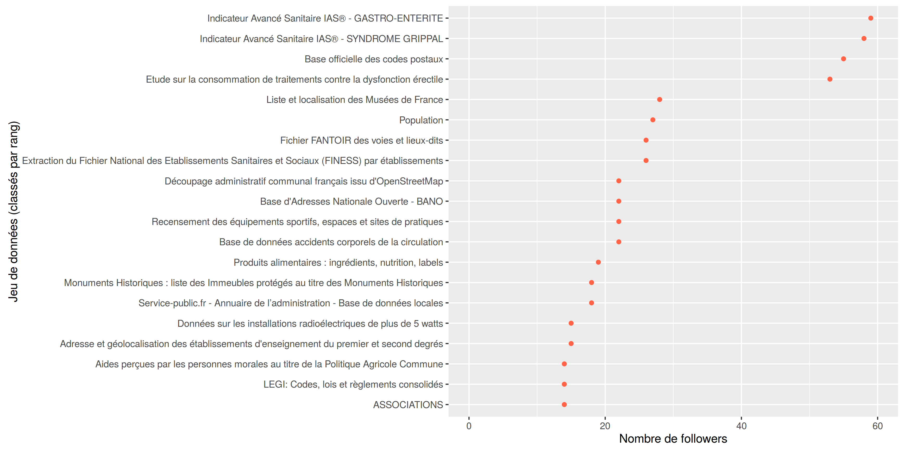
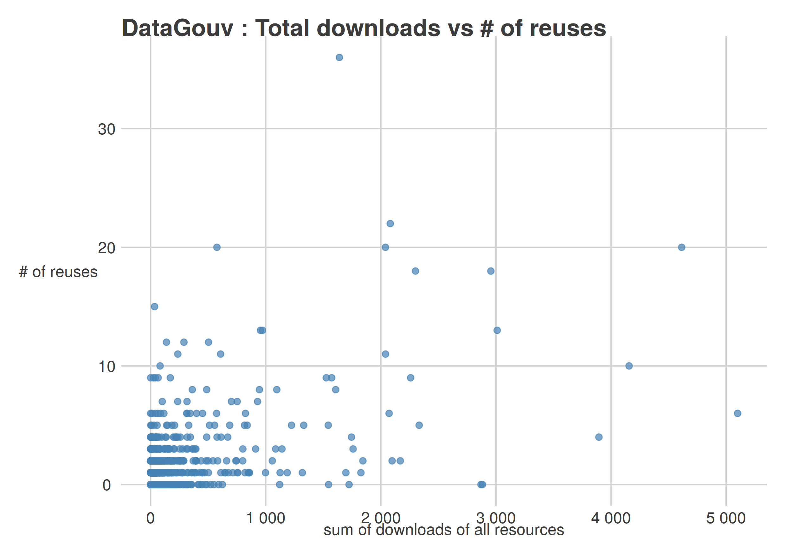

## exploreDataGouv

* Objectif : identifier les jeux de données les plus demandés sur DataGouv

### Top200

Critères : 
- nombre de followers
- nombre de réutilisations 
- nombre de téléchargements des ressources

- [HTML data table](http://htmlpreview.github.io/?https://github.com/SGMAP-AGD/exploreDataGouv/blob/master/output/dt_data_top200.html)

### Nombre de followers

### Lien entre le nombre de réutilisations et nombre de téléchargements ?

## Réseau des jeux de données

### Code

- [import_csv.R] : importe les données au format csv
- [import_json.R] : importe les données au format JSON (API)
- [make_df_data.R] : crée la table df_data à partir de la table de ressources
- [make_df_data_resources.R] : calcule le nombre de ressources et 
le total des téléchargements

### Problèmes

- Problème avec le fichier datasets.csv, nombre de lignes
