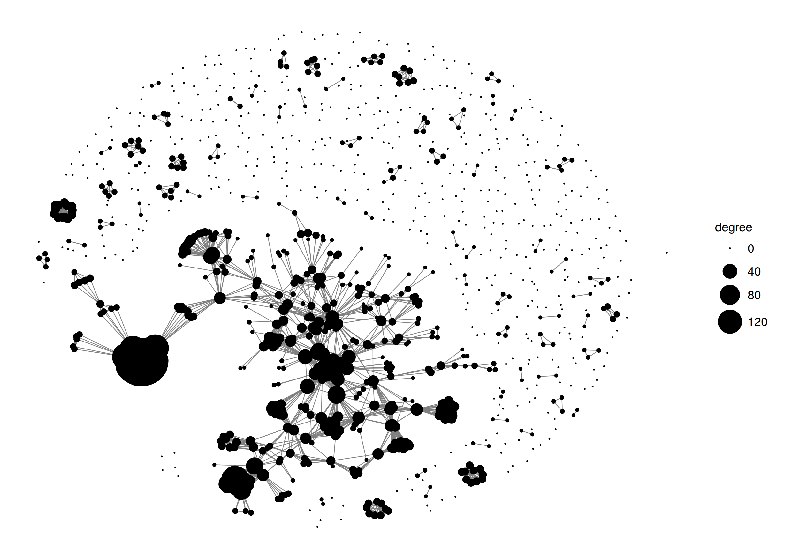

## exploreDataGouv

* Objectif : identifier les jeux de données les plus demandés sur DataGouv

### Top200

Critères : 
- nombre de followers
- nombre de réutilisations 
- nombre de téléchargements des ressources

- [Interactive table](https://htmlpreview.github.io/?https://raw.githubusercontent.com/SGMAP-AGD/exploreDataGouv/master/output/dt_data_top200.html)

### Nombre de followers

### Lien entre le nombre de réutilisations et nombre de téléchargements ?

## Réseau des jeux de données

## Code

- [import_csv.R](R/import_csv.R) : importe les données au format csv
- [import_json.R](R/import_json.R) : importe les données au format JSON (API)
- [make_df_data.R](R/make_df_data.R) : crée la table des jeux de données à partir de la table des ressources
- [make_df_data_resources.R](R/make_df_resources.R) : calcule le nombre de ressources et 
le total des téléchargements
- [make_df_data_reuses.R](R/make_df_reuses.R) : calcule le nombre de réutilisations par jeu de données
- [make_df_data_followers.R](R/make_df_data_followers.R) : récupère le nombre de followers par jeu de données
- [make_df_data_top200.R](R/make_df_data_top200.R) : crée la table des jeux de données pour étudier le top200
- [datatable_data_top200.R](R/datatable_data_top200.R) : crée la table html interactive

## Data

## Problèmes

- Problème avec le fichier datasets.csv, nombre de lignes
